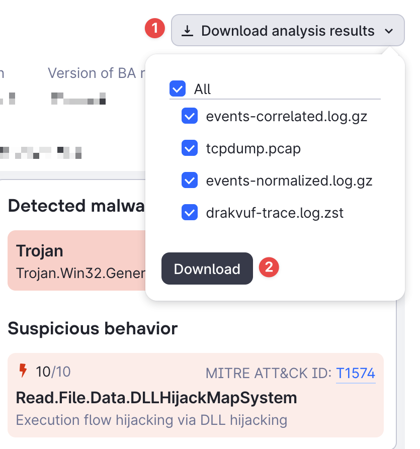

## Structure

After the behavioral analysis, you can download the analysis results which include:

- `events-correlated.log.gz` - verdicts. In this case, `Trojan.Win32.Generic.a`;
- `tcpdump.pcap` - a file with network events in `pcap` format;
- `events-normalized.log.gz` - enriched events received from the analysis system;
- `drakvuf-trace.log.zst` - raw data from the analysis system;

{ width="380" loading=lazy }

## How to analyze

Just call the `conv` (or `unpack`) option and specify the file with the downloaded logs. In this case, `sandbox_logs.zip`:

<!-- termynal -->

```
$ sandbox-cli conv sandbox_logs.zip

[INFO] Unpacking sandbox_logs.zip
```

The `sandbox-cli` unpacks logs into a convenient format, decomposes events by plugins, structures output, etc.

```sh title="tree" hl_lines="5"
sandbox_logs
├── correlated
│   ├── events-correlated.log
│   ├── events-correlated.log.malware
│   └── events-correlated.log.suspicious.Read.File.Data.DLLHijackMapSystem
├── drakvuf-trace
│   └── drakvuf-trace.log
├── network
│   └── tcpdump.pcap
├── normalized
│   ├── events-normalized.log
│   ├── events-normalized.log.apimon
│   ├── events-normalized.log.cpuidmon
│   └── events-normalized.log.syscall
└── raw
    ├── drakvuf-trace.log.zst
    ├── events-correlated.log.gz
    ├── events-normalized.log.gz
    └── tcpdump.pcap
```

!!! note "Note"

    The output is greatly reduced because a lot of information is collected under Windows

Now you can easily find a suspicious event and analyze it.

```json title="event"
{
  "object.path": "users\\jamie\\desktop\\malware.dll",
  "process.id": "2828",
  "process.name": "users\\jamie\\desktop\\malware.exe",
  "weight": 10,
  "unixtime": "1741811223.840229",
  "detect.name": "Read.File.Data.DLLHijackMapSystem",
  "detect.type": "suspicious",
  "mitre.tid": "T1574"
}
```

!!! tip "Tip"

    You can specify not only one file, but also several in a row if you need to parse several logs.

    ```sh
    sandbox-cli conv sandbox_logs.zip sandbox_logs_1.zip sandbox_logs_2.zip
    ```

## Help

<!-- termynal -->

```sh
$ sandbox-cli conv --help

Usage: sandbox-cli conv [ARGS]

Convert sandbox logs into an analysis-friendly format.

Output file structure:

 • drakvuf-trace
    • drakvuf-trace.log
 • correlated
    • events-correlated.log
    • events-correlated.log.<DETECT_NAME>
 • normalized
    • events-normalized.log
    • events-normalized.log.<DETECT_NAME>
 • network
    • tcpdump.pcap
 • raw
    • drakvuf-trace.log.zst
    • tcpdump.pcap

Usage examples:

 • Checks for drakvuf-trace.log.gz or drakvuf-trace.log.zst in the current directory: sandbox-cli unpack .
 • Extracts and processes logs into the sandbox_logs directory: sandbox-cli unpack sandbox_logs.zip
 • Handles multiple archives simultaneously: sandbox-cli unpack sandbox_logs.zip sandbox_logs_1.zip

╭─ Arguments ───────────────────────────────────────────────────────────────────────────────────────────────╮
│ *  TRACES  The path to the folder with the raw traces or with the sandbox-logs.zip [required]             │
╰───────────────────────────────────────────────────────────────────────────────────────────────────────────╯
```
